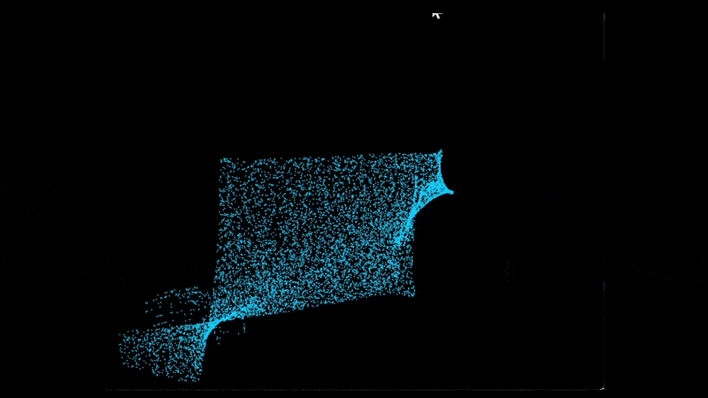

# 计算机图形学实验报告

## 实验一：图形学开发工具

**姓名：** 王宇畅
**学号：** 202311030025
**授课教师：** 张鸿文
**助教：** 张怡冉
**日期：** 2026年3月17日

---

## 一、项目架构

采用标准的 src 布局，实现代码与配置的物理隔离：

```
CG-Lab/
├── .venv/                 # 虚拟环境
├── assets/                # 演示资源
│   ├── demo.gif          # 运行效果演示
├── src/
│   └── Work0/
│       ├── __init__.py
│       ├── config.py     # 配置文件
│       ├── physics.py    # GPU物理计算
│       └── main.py       # 主程序入口
├── .gitignore
├── pyproject.toml
└── README.md
```

---

## 二、核心代码逻辑

### 2.1 配置模块 (config.py)
集中管理所有参数：粒子数量、引力强度、窗口大小、颜色等。

### 2.2 物理计算模块 (physics.py)
使用 Taichi 在 GPU 上并行更新粒子：
```python
@ti.kernel
def update_particles(mouse_x: float, mouse_y: float):
    for i in range(NUM_PARTICLES):
        # 鼠标引力计算
        dir = ti.Vector([mouse_x, mouse_y]) - pos[i]
        vel[i] += dir.normalized() * GRAVITY_STRENGTH
        vel[i] *= DRAG_COEF
        pos[i] += vel[i]
```

### 2.3 主程序模块 (main.py)
负责窗口创建、鼠标交互和渲染循环。

---

## 三、运行效果展示

### 粒子群演示
\
*鼠标移动吸引粒子，形成动态团簇*

---

## 四、实验要求完成情况

| 要求 | 完成情况 | 说明 |
|------|----------|------|
| 要求1：uv环境隔离 | ✓ | 使用 `uv venv` 创建独立虚拟环境 |
| 要求2：src布局规范 | ✓ | 代码按功能分层，物理隔离 |
| 要求3：GPU并行计算 | ✓ | 成功调用 Vulkan 后端，粒子更新由 GPU 并行执行 |
| 要求4：Git代码管理 | ✓ | 代码已上传 GitHub，包含完整文档和演示 |

---

## 五、Git仓库链接

🔗 **https://github.com/char-math/CG-Lab**

---

**实验完成日期**：2026年3月17日
