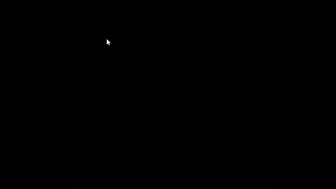
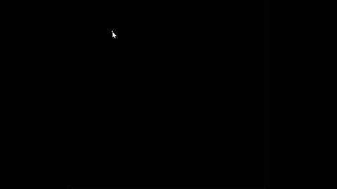

# 计算机图形学实验报告
## 实验三：贝塞尔曲线的绘制与交互

**姓名：** 王宇畅  
**学号：** 202311030025  
**授课教师：** 张鸿文  
**助教：** 张怡冉  
**日期：** 2026年4月15日

---

## 一、项目架构

采用标准的 src 布局，实现代码与配置的物理隔离：

```
CG-Lab/
├── .venv/                 # 虚拟环境
├── Work3/
│   ├── src/
│   │   └── main.py        # 主程序入口（含选做内容）
│   └── README.md
└── requirements.txt       # 依赖：taichi, numpy
```

---

## 二、实验目标

1. 理解贝塞尔曲线的几何意义
2. 实现 De Casteljau 算法计算贝塞尔曲线
3. 掌握光栅化基础：在像素缓冲区中直接操作像素
4. 掌握鼠标点击与键盘交互事件处理
5. 选做：实现抗锯齿效果和 B 样条曲线

---

## 三、核心代码逻辑

### 3.1 配置参数

```python
WIDTH = 800
HEIGHT = 800
MAX_CONTROL_POINTS = 100
NUM_SEGMENTS = 1000

# GPU 缓冲区
pixels = ti.Vector.field(3, dtype=ti.f32, shape=(WIDTH, HEIGHT))
gui_points = ti.Vector.field(2, dtype=ti.f32, shape=MAX_CONTROL_POINTS)
gui_indices = ti.field(dtype=ti.i32, shape=MAX_CONTROL_POINTS * 2)
curve_points_field = ti.Vector.field(2, dtype=ti.f32, shape=NUM_SEGMENTS + 1)
```

### 3.2 De Casteljau 算法

```python
def de_casteljau(points, t):
    """递归线性插值计算贝塞尔曲线上的点"""
    if len(points) == 1:
        return points[0]
    
    next_points = []
    for i in range(len(points) - 1):
        p0 = points[i]
        p1 = points[i + 1]
        x = (1.0 - t) * p0[0] + t * p1[0]
        y = (1.0 - t) * p0[1] + t * p1[1]
        next_points.append([x, y])
    
    return de_casteljau(next_points, t)
```

**算法原理**：
- 输入 n 个控制点 P₀, P₁, ..., Pₙ₋₁
- 对于参数 t ∈ [0,1]，在相邻点间线性插值得到 n-1 个新点
- 重复上述步骤直到只剩一个点
- 该点即为贝塞尔曲线在参数 t 处的位置

### 3.3 光栅化与 GPU 并行绘制

```python
@ti.kernel
def draw_curve_kernel(n: ti.i32, is_bspline: ti.i32):
    """GPU 并行绘制曲线点"""
    for i in range(n):
        pt = curve_points_field[i]
        x_pixel = ti.cast(pt[0] * WIDTH, ti.i32)
        y_pixel = ti.cast(pt[1] * HEIGHT, ti.i32)
        if 0 <= x_pixel < WIDTH and 0 <= y_pixel < HEIGHT:
            if is_bspline == 1:
                pixels[x_pixel, y_pixel] = ti.Vector([0.0, 0.5, 1.0])  # 蓝色
            else:
                pixels[x_pixel, y_pixel] = ti.Vector([0.0, 1.0, 0.0])  # 绿色
```

**性能优化核心**：
- CPU 端一次性计算所有曲线点（1000 个）
- 批量传输到 GPU 缓冲区
- GPU 并行点亮所有像素
- 避免每计算一个点就跨 PCIe 通信

### 3.4 控制多边形绘制

```python
@ti.kernel
def draw_line_kernel(x1: ti.f32, y1: ti.f32, x2: ti.f32, y2: ti.f32):
    """DDA 算法绘制直线"""
    x1_pixel = ti.cast(x1 * WIDTH, ti.i32)
    y1_pixel = ti.cast(y1 * HEIGHT, ti.i32)
    x2_pixel = ti.cast(x2 * WIDTH, ti.i32)
    y2_pixel = ti.cast(y2 * HEIGHT, ti.i32)
    
    dx = ti.abs(x2_pixel - x1_pixel)
    dy = ti.abs(y2_pixel - y1_pixel)
    
    if dx >= dy:
        # 斜率小于等于1的情况
        # ... DDA 算法实现
    else:
        # 斜率大于1的情况
        # ... DDA 算法实现
```

### 3.5 交互控制与对象池

```python
def main():
    window = ti.ui.Window("Bezier & B-Spline", (WIDTH, HEIGHT))
    control_points = []
    antialiasing = False
    mode = 0  # 0: Bezier, 1: B-Spline
    
    while window.running:
        # 键盘事件
        for event in window.get_events(ti.ui.PRESS):
            if event.key == 'c': control_points.clear()
            elif event.key == 'b': mode = 1 - mode
            elif event.key == 'a': antialiasing = not antialiasing
        
        # 鼠标点击添加控制点
        if window.is_pressed(ti.ui.LMB):
            pos = window.get_cursor_pos()
            control_points.append([pos[0], pos[1]])
        
        # 对象池技巧：预分配固定大小 GPU 缓冲区
        np_points = np.full((MAX_CONTROL_POINTS, 2), -10.0, dtype=np.float32)
        np_points[:len(control_points)] = np.array(control_points)
        gui_points.from_numpy(np_points)
        canvas.circles(gui_points, radius=0.008, color=(1.0, 0.0, 0.0))
```
### 3.5 结果演示
\

---

## 四、选做内容

### 4.1 抗锯齿效果

```python
@ti.kernel
def draw_antialiased_bezier_kernel(n: ti.i32):
    """基于距离衰减的抗锯齿绘制"""
    for i in range(n):
        pt = curve_points_field[i]
        x_float = pt[0] * WIDTH
        y_float = pt[1] * HEIGHT
        
        x_center = ti.cast(x_float, ti.i32)
        y_center = ti.cast(y_float, ti.i32)
        
        # 考察 5x5 邻域
        for dx in range(-2, 3):
            for dy in range(-2, 3):
                px = x_center + dx
                py = y_center + dy
                if 0 <= px < WIDTH and 0 <= py < HEIGHT:
                    dist = ti.sqrt(float(dx*dx + dy*dy))
                    if dist <= 2.0:
                        alpha = 1.0 - dist / 2.5  # 距离越近越亮
                        pixels[px, py] += ti.Vector([0.0, 1.0, 0.0]) * alpha
```

**原理**：
- 几何点坐标具有亚像素精度
- 计算几何点周围 5×5 像素的距离
- 距离越近的像素获得更高的亮度权重
- 视觉上实现平滑过渡，消除锯齿

### 4.2 B 样条曲线

```python
def compute_bspline_curve(control_points, num_segments):
    """均匀三次 B 样条曲线"""
    n = len(control_points)
    if n < 4:
        return []
    
    curve_points = []
    segments_per_span = num_segments // (n - 3)
    
    for i in range(n - 3):
        p0, p1, p2, p3 = control_points[i:i+4]
        
        for j in range(segments_per_span + 1):
            t = j / segments_per_span
            
            # 三次 B 样条基函数
            b0 = (1 - t) ** 3 / 6
            b1 = (3 * t**3 - 6 * t**2 + 4) / 6
            b2 = (-3 * t**3 + 3 * t**2 + 3 * t + 1) / 6
            b3 = t**3 / 6
            
            x = b0 * p0[0] + b1 * p1[0] + b2 * p2[0] + b3 * p3[0]
            y = b0 * p0[1] + b1 * p1[1] + b2 * p2[1] + b3 * p3[1]
            curve_points.append([x, y])
    
    return curve_points
```

**B 样条 vs 贝塞尔对比**：

| 特性 | 贝塞尔曲线 | B 样条曲线 |
|------|-----------|-----------|
| 控制方式 | 全局控制 | 局部控制 |
| 最低点数 | 2 个点 | 4 个点 |
| 曲线阶数 | n-1 阶 | 固定 3 阶 |
| 颜色标识 | 绿色 | 蓝色 |
| 适用场景 | 简单曲线设计 | 复杂形状建模 |

---
### 4.3 结果演示
\

## 六、实验总结

本次实验成功实现了贝塞尔曲线的完整渲染管线：

**理论验证**：
- 通过 De Casteljau 算法验证了贝塞尔曲线的递归线性插值原理
- 理解参数 t 从 0 到 1 连续变化形成完整曲线

**实践应用**：
- 实现了鼠标交互添加控制点
- 键盘控制模式切换和清空功能
- 实时显示控制多边形和曲线

**性能优化**：
- CPU 批量计算 + GPU 并行绘制
- 对象池技术避免动态内存分配
- 仅在控制点变化时重新计算曲线

**选做成果**：
- 抗锯齿：5×5 邻域距离衰减，曲线边缘平滑
- B 样条：均匀三次 B 样条，实现局部控制特性

**遇到的问题与解决**：
1. Taichi kernel 中不支持非静态条件 return → 改用 if 包裹逻辑
2. 变量作用域问题导致抗锯齿崩溃 → 明确变量定义位置
3. B 样条初始实现错误 → 改用标准三次 B 样条基函数公式

本次实验为后续复杂的曲线曲面建模奠定了坚实基础。

---

## 七、Git 仓库链接

🔗 https://github.com/char-math/CG-Lab/experiment/Work3

---

**实验完成日期：** 2026年4月15日
